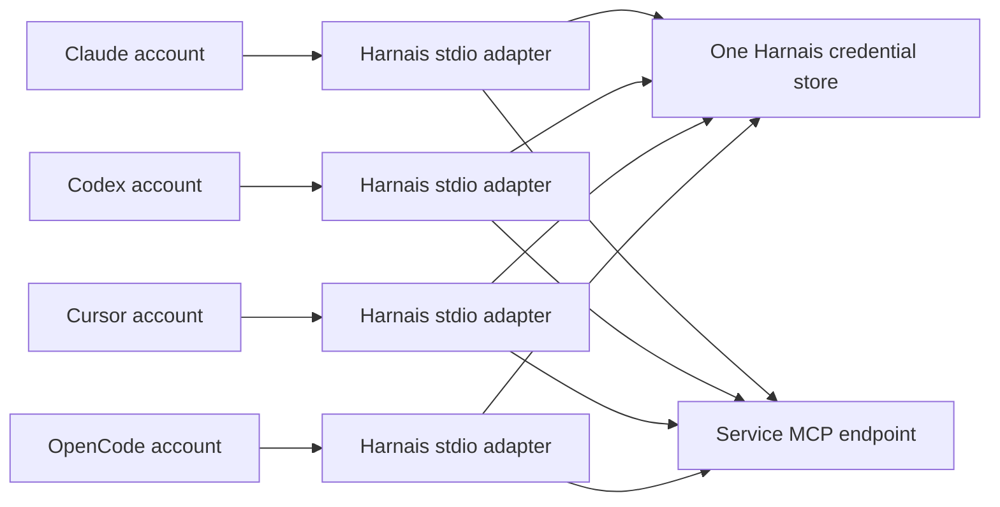

# Shared connections in Harnais

Harnais owns one service identity per shared connection. Each local coding account
starts `harnais mcp serve <name>` through its normal MCP configuration. That process
loads the central credential and opens an independent session with the upstream
service. Adding another coding account does not require another service login.

The shared identity is the person or service account authorized upstream, regardless
of which coding account invokes it. Separate workspaces or permission boundaries
should use separate shared connections. Local processes running as the same macOS
user are in the same trust boundary; a connection is not isolated from that user.

## Connections UI

- **Shared:** Harnais-owned service logins. Manage the endpoint, credentials, OAuth
  client, display name, server name, and sharing toggle centrally. Account status
  shows whether the adapter is configured, not whether a live tool call succeeded.
- **Added:** installed or configured plugins, integrations, and MCP servers. Manage
  opens the authoritative settings file and exposes applicable provider login
  commands. **Share login** offers a separate Harnais-owned connection for known
  integrations or remote MCP endpoints. It never copies another app's OAuth token.
- **Built-in:** tools identified as bundled with the provider. Currently the local
  inventory can identify Codex's `openai-bundled` distribution. An official
  marketplace listing alone does not make a plugin built-in. This section starts
  collapsed; search expands matching results.

Added rows group the same service across providers, plugins, and direct MCP configurations. Each occurrence retains its provider, account, source, scope, and warnings. Grouping does not merge credentials or imply equivalent permissions. Manage shows the
account-specific warnings and source. Inventory is read-only and does not start
servers. Provider-hosted connectors are outside local inventory; project coverage
is limited to Claude's saved project MCP declarations. Cursor plugin cache presence
does not prove activation.

## Provider configuration

All four local providers support stdio MCP. Exported entries contain only the
Harnais executable and connection name, never service tokens or OAuth secrets.

| Provider | Configuration | Export |
| --- | --- | --- |
| Claude Code | Default `~/.claude.json`, isolated `CLAUDE_CONFIG_DIR/.claude.json` | `mcpServers`, command and args |
| Codex | Effective `CODEX_HOME/config.toml` including Harnais shadow homes | `mcp_servers`, command and args in a marked block |
| Cursor | Effective `CURSOR_CONFIG_DIR/mcp.json` | `mcpServers`, command and args |
| OpenCode | `OPENCODE_CONFIG` or XDG config; existing JSONC preferred | `mcp`, local command array; existing v2 `mcp.servers` retained |

Sync validates all destinations before writing, uses unique `harnais-…` names,
refuses to overwrite an unrelated server with that name, and keeps owner-readable
backups. JSON/JSONC is rewritten as formatted JSON, so comments are retained in the
backup rather than the active file. Unrelated settings remain. Removal deletes
Harnais-owned wrappers; provider tools may need a restart to reload their settings.
Sync is explicit for settings changes. Failed sync is visible and can be retried.

OpenCode's installed v1 uses direct `mcp` entries. Existing v2 `mcp.servers` maps are
supported; a fresh v2 installation without such a map needs a v2 config created
before syncing. Provider-specific plugin manifests and cloud/web agent environments
cannot be made portable simply by copying a local stdio configuration.

## Authentication and transport

Follow the [product OAuth registration guide](oauth-app-registration.md) for release status and maintainer setup. Ordinary users choose a service and sign in. Advanced settings support custom app registrations. Personal and Work are connection labels.

OAuth uses Harnais's own client registration, PKCE, state verification, and the
service resource identifier. Google Drive, Gmail, Outlook, and Slack need a registered app/client;
Slack requires an internal or published app. Atlassian supports dynamic
registration. Custom MCP accepts an OAuth-enabled Streamable HTTP URL and either
server-supported dynamic registration or supplied client credentials. Grafana uses
its own service-account token and a locally installed `mcp-grafana` process.

Credentials are owner-readable files in
`~/.harnais/integrations/<kind>/<slug>/credentials.json`, with owner-only directories.
Harnais-owned OAuth and Grafana credentials are not currently stored in Keychain. Aikido is an exception: its official server owns its macOS Keychain login. OAuth refresh uses a cross-process lock:
when two accounts encounter expiration or the same rejected token, the second
reuses the first's refreshed credential. Settings changes use that same lock.
Changing a custom endpoint or client invalidates the old authorization.

The HTTP bridge handles JSON and incremental SSE, forwards server requests while
continuing to read client responses, tracks a separate session ID per process, and
sends the negotiated protocol version. It refuses redirects on credential-bearing
requests and allows HTTPS, plus HTTP loopback for local servers. A 401 gets one
refresh/retry. HTTP 403 reports permission failure; HTTP 404 or a dropped stream
requires reconnecting the MCP client. Automatic session restoration, SSE event
replay, and explicit session DELETE on shutdown are not implemented.

The generic custom connection currently requires OAuth. Arbitrary static bearer
headers, generic local-command sharing, and legacy HTTP+SSE endpoints are not
supported through that form. Provider tool approvals remain separate from upstream
service authentication and may still be requested by each coding tool.

## Moving an existing connection

1. Open its Added row, select the account/server, and choose **Share login**.
2. Register Harnais's callback where required and authorize the service once.
3. Sync the shared adapter and verify a tool call in each intended provider.
4. Disable the old direct server in that provider's settings to avoid duplicate tools.

Old account connections are preserved until explicitly changed. Reusing Cursor's
Slack client ID or copying provider refresh tokens is not a supported migration.
The application cannot authorize a vendor account on the user's behalf without
the vendor's sign-in and consent flow.

## Validation and primary references

`./scripts/test.sh` covers inventory classification, settings, credentials,
configuration collision preflight, preservation, and provider export. After
`swift build --product harnais`, `python3 scripts/test-shared-mcp.py` exercises two
real bridge processes against a local fixture: concurrent refresh, separate sessions,
interactive SSE, 401 recovery, and redirect refusal. Live vendor authorization
is not part of these automated checks.

Reviewed September 28, 2026:

- [MCP transport specification](https://modelcontextprotocol.io/specification/2025-11-25/basic/transports)
- [MCP authorization specification](https://modelcontextprotocol.io/specification/2025-11-25/basic/authorization)
- [Claude Code MCP configuration and plugin servers](https://code.claude.com/docs/en/mcp)
- [Codex MCP configuration](https://learn.chatgpt.com/docs/extend/mcp?surface=cli)
- [Cursor MCP configuration](https://docs.cursor.com/context/model-context-protocol)
- [OpenCode MCP configuration](https://opencode.ai/docs/mcp-servers/)
- [OpenCode v2 MCP configuration](https://opencode.ai/v2/docs/mcp-servers)
- [Slack MCP requirements](https://docs.slack.dev/ai/slack-mcp-server/)

Gmail and Outlook use local read-only mail adapters over their stable REST APIs. Gmail supports listing/searching message IDs, reading messages, and listing labels. Outlook supports listing/searching and reading messages. Neither adapter sends or modifies mail.

Run `python3 scripts/probe-shared-connections.py <name> --tool <read-tool> --record` for explicit live checks through each registered account's configured command. Dated results appear in Manage and failures are account warnings. Tool discovery alone is not a successful data-read check. Reports contain no returned service data or credentials.

## Aikido and Excalidraw

Aikido uses the official `@aikidosec/mcp@1.0.17` server and its browser login. Harnais keeps that process alive while its loopback callback completes, verifies the saved login through the vendor tool, and then shares the server with local coding accounts. The login stays in Aikido's macOS Keychain entry. Only one Aikido login is supported per macOS user. No Harnais-owned OAuth app or copied GitLab token is used. Provider-specific plugin skills are separate from this MCP server.

Excalidraw has two distinct shared modes. The official remote server at `https://mcp.excalidraw.com/mcp` provides five diagram tools and needs no login. Local canvas mode runs `mcp-excalidraw-server@2.0.0` and preserves the existing 26 canvas tools. Both are available because they are not interchangeable. MCP Apps interfaces depend on the coding tool's support; passing tool calls does not establish that every client renders an interactive canvas.

Cached or deliberately disabled plugins are shown as installed files rather than connection failures. Actual missing binaries, missing credentials, configuration conflicts, and failed live checks still require attention.

Sources: [Aikido's official plugin](https://github.com/AikidoSec/aikido-cursor-plugin), [official Excalidraw server](https://github.com/excalidraw/excalidraw-mcp), [local canvas server](https://github.com/yctimlin/mcp_excalidraw).
